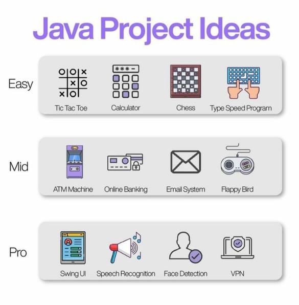

# Coding with Java 

In this repository I am practicing coding

## Inspiration

## Projetcs

### Tic tac toe

📝 [Code](TicTacToe.java)

<em>With the collaboration of [Amanda Medeiros](https://github.com/medeirosamandas)</em>

